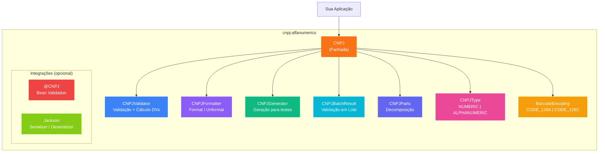

<div align="center">

# CNPJ Alfanumérico

**Validação, formatação e geração de CNPJ alfanumérico — uma dependência, tudo pronto.**

[](https://openjdk.org)
[](https://central.sonatype.com/artifact/io.github.johnpitter/cnpj-alfanumerico)
[](LICENSE)
[](https://github.com/JohnPitter/cnpj-alfanumerico/actions)

[Funcionalidades](#-funcionalidades) · [Quick Start](#-quick-start) · [API](#-api-reference) · [Migração](#-guia-de-migração) · [Integrações](#-integrações) · [Compatibilidade](#-compatibilidade)

</div>

---

## O que é?

Biblioteca Java **zero dependências** para trabalhar com o novo CNPJ alfanumérico da Receita Federal do Brasil ([IN RFB nº 2.229/2024](http://normas.receita.fazenda.gov.br/sijut2consulta/link.action?idAto=141102)).

A partir de **julho de 2026**, novos CNPJs poderão conter letras (A-Z) nas 12 primeiras posições. Esta biblioteca implementa o algoritmo oficial de validação (Módulo 11 com conversão ASCII-48) e é **100% retrocompatível** com CNPJs numéricos existentes.

Adicione ao seu projeto e substitua sua validação atual — funciona tanto com CNPJs legados quanto com o novo formato.

---

## ✨ Funcionalidades

| Categoria | O que você ganha |
|---|---|
| **Validação** | Valida CNPJ numérico (legado) e alfanumérico (novo) com algoritmo oficial Módulo 11 |
| **Validação em Lote** | Valida coleções inteiras com resultado detalhado (válidos, inválidos, contagens por tipo) |
| **Formatação** | Formata (`12ABC34501DE35` → `12.ABC.345/01DE-35`) e desformata |
| **Cálculo de DVs** | Calcula dígitos verificadores a partir de 12 caracteres base |
| **Classificação** | Detecta se é numérico ou alfanumérico, retorna tipo via enum |
| **Comparação** | Compara CNPJs ignorando formato/case; detecta mesma empresa |
| **Extração** | Decompõe em raiz (8), ordem (4) e DVs (2); verifica se é matriz |
| **Listagem de Filiais** | Gera CNPJs completos para múltiplas filiais a partir da raiz |
| **Geração** | Gera CNPJs válidos aleatórios para testes (alfanumérico e numérico) |
| **Máscara LGPD** | Mascara CNPJs para exibição segura em logs e telas |
| **Migração de Storage** | Detecta se CNPJ requer migração de coluna BIGINT → VARCHAR |
| **Código de Barras** | Indica encoding correto (CODE-128A vs CODE-128C) |
| **Bean Validation** | Annotation `@CNPJ` para validação em DTOs (JSR 380) |
| **Jackson Support** | Serializer/Deserializer para integração com JSON |
| **Regex Patterns** | Patterns compilados para validação em formulários e schemas |
| **Zero Dependências** | Apenas Java puro — sem libs externas em runtime |

---

## 🏗️ Arquitetura



---

## 🚀 Quick Start

### 1. Adicione a dependência

**Maven:**

```xml
<dependency>
    <groupId>io.github.johnpitter</groupId>
    <artifactId>cnpj-alfanumerico</artifactId>
    <version>1.1.0</version>
</dependency>
```

**Gradle:**

```groovy
implementation 'io.github.johnpitter:cnpj-alfanumerico:1.1.0'
```

**Gradle (Kotlin DSL):**

```kotlin
implementation("io.github.johnpitter:cnpj-alfanumerico:1.1.0")
```

### 2. Use

```java
import io.github.johnpitter.cnpj.CNPJ;

// Validação — funciona com numérico e alfanumérico
CNPJ.isValid("12.ABC.345/01DE-35");  // true
CNPJ.isValid("11.222.333/0001-81");  // true (legado)

// Formatação
CNPJ.format("12ABC34501DE35");     // "12.ABC.345/01DE-35"
CNPJ.unformat("12.ABC.345/01DE-35"); // "12ABC34501DE35"

// Comparação
CNPJ.equals("12.ABC.345/01DE-35", "12abc34501de35"); // true
CNPJ.isSameCompany(matrizCnpj, filialCnpj);          // true

// Máscara LGPD
CNPJ.mask("12ABC34501DE35");       // "12.***.345/01DE-**"
CNPJ.mask("12ABC34501DE35", 4);    // "12AB**********"

// Validação em lote
CNPJBatchResult result = CNPJ.validateBatch(listaDeCnpjs);
result.getValidCount();             // 150
result.getAlphanumericCount();      // 3 — precisam de migração!

// Migração de storage
CNPJ.requiresStorageMigration("12ABC34501DE35"); // true
CNPJ.getMinColumnType("12ABC34501DE35");          // "CHAR(14)"
CNPJ.getBarcodeEncoding("12ABC34501DE35");        // CODE_128A

// Geração de filiais
CNPJ.listBranches("12ABC345", Arrays.asList("0001", "0002", "01DE"));
```

**Pronto.** Sem configuração, sem dependências externas.

---

## 📖 API Reference

### Validação

| Método | Retorno | Descrição |
|---|---|---|
| `CNPJ.isValid(String)` | `boolean` | Valida CNPJ (com ou sem formatação) |
| `CNPJ.validate(String)` | `void` | Valida e lança `CNPJException` se inválido |
| `CNPJ.calculateCheckDigits(String)` | `String` | Calcula os 2 DVs a partir de 12 caracteres base |
| `CNPJ.validateBatch(Collection)` | `CNPJBatchResult` | Valida coleção com resultado detalhado |

### Comparação

| Método | Retorno | Descrição |
|---|---|---|
| `CNPJ.equals(String, String)` | `boolean` | Compara ignorando formato e case |
| `CNPJ.isSameCompany(String, String)` | `boolean` | Mesma raiz = mesma empresa |

### Formatação

| Método | Retorno | Descrição |
|---|---|---|
| `CNPJ.format(String)` | `String` | Formata: `XX.XXX.XXX/XXXX-XX` |
| `CNPJ.unformat(String)` | `String` | Remove máscara (14 chars, uppercase) |
| `CNPJ.isFormatted(String)` | `boolean` | Verifica se está com máscara |
| `CNPJ.isUnformatted(String)` | `boolean` | Verifica se está sem máscara |
| `CNPJ.mask(String)` | `String` | Mascara para LGPD: `12.***.345/01DE-**` |
| `CNPJ.mask(String, int)` | `String` | Mascara com N chars visíveis |

### Classificação

| Método | Retorno | Descrição |
|---|---|---|
| `CNPJ.isAlphanumeric(String)` | `boolean` | Contém letras (novo formato) |
| `CNPJ.isNumeric(String)` | `boolean` | Apenas números (legado) |
| `CNPJ.getType(String)` | `CNPJType` | `NUMERIC` ou `ALPHANUMERIC` |

### Extração de Partes

| Método | Retorno | Descrição |
|---|---|---|
| `CNPJ.parse(String)` | `CNPJParts` | Decompõe em root + branch + checkDigits |
| `CNPJ.getRoot(String)` | `String` | Raiz — 8 primeiros caracteres |
| `CNPJ.getBranch(String)` | `String` | Ordem do estabelecimento (4 chars) |
| `CNPJ.getCheckDigits(String)` | `String` | Dígitos verificadores (2 chars) |
| `CNPJ.isHeadquarters(String)` | `boolean` | `true` se branch == "0001" (matriz) |

### Migração e Storage

| Método | Retorno | Descrição |
|---|---|---|
| `CNPJ.requiresStorageMigration(String)` | `boolean` | `true` se não cabe em BIGINT |
| `CNPJ.getMinColumnType(String)` | `String` | `"BIGINT"` ou `"CHAR(14)"` |
| `CNPJ.getBarcodeEncoding(String)` | `BarcodeEncoding` | `CODE_128C` ou `CODE_128A` |

### Geração (para testes)

| Método | Retorno | Descrição |
|---|---|---|
| `CNPJ.generate()` | `String` | CNPJ alfanumérico aleatório válido |
| `CNPJ.generateFormatted()` | `String` | Alfanumérico aleatório formatado |
| `CNPJ.generateNumeric()` | `String` | CNPJ numérico aleatório válido |
| `CNPJ.generateNumericFormatted()` | `String` | Numérico aleatório formatado |
| `CNPJ.generateFromParts(root, branch)` | `String` | Com raiz e ordem específicas |
| `CNPJ.generateFromBase(base12)` | `String` | A partir dos 12 chars base |
| `CNPJ.generateHeadquarters(root)` | `String` | Matriz (branch=0001) |
| `CNPJ.listBranches(root, branches)` | `List<String>` | CNPJs para múltiplas filiais |

### Regex Patterns

| Método | Pattern | Descrição |
|---|---|---|
| `CNPJ.getPattern()` | `[A-Z0-9]{12}[0-9]{2}` | CNPJ sem formatação |
| `CNPJ.getFormattedPattern()` | `XX.XXX.XXX/XXXX-XX` | CNPJ com formatação |
| `CNPJ.getLegacyPattern()` | `[0-9]{14}` | CNPJ numérico (legado) |
| `CNPJ.getLegacyFormattedPattern()` | `XX.XXX.XXX/XXXX-XX` | Numérico formatado |

---

## 🔗 Integrações

### Bean Validation (`@CNPJ`)

Annotation para validação automática em DTOs:

```java
import io.github.johnpitter.cnpj.validation.CNPJ;

public class EmpresaDTO {
    @CNPJ
    private String cnpj;

    @CNPJ(message = "CNPJ da filial inválido")
    private String cnpjFilial;
}
```

Validação programática:

```java
import io.github.johnpitter.cnpj.validation.CNPJConstraintValidator;

boolean valid = CNPJConstraintValidator.isValid(dto.getCnpj()); // null → true
```

### Jackson (JSON)

Serialize/deserialize CNPJs em APIs REST:

```java
import io.github.johnpitter.cnpj.jackson.CNPJSerializer;
import io.github.johnpitter.cnpj.jackson.CNPJDeserializer;

// Serialização: "12ABC34501DE35" → "12.ABC.345/01DE-35"
String json = CNPJSerializer.serialize(cnpj);

// Deserialização: "12.ABC.345/01DE-35" → "12ABC34501DE35"
String clean = CNPJDeserializer.deserialize(jsonValue);
```

---

## 🔄 Guia de Migração

### Para sistemas que já validam CNPJ numérico

**Antes (validação numérica):**
```java
// ❌ Vai quebrar com CNPJs alfanuméricos
boolean valid = cnpj.matches("\\d{14}");
```

**Depois (com a biblioteca):**
```java
// ✅ Funciona com numérico E alfanumérico
boolean valid = CNPJ.isValid(cnpj);
```

### Auditoria em lote da base de dados

```java
// Valide toda a base de CNPJs de uma vez
CNPJBatchResult result = CNPJ.validateBatch(todosOsCnpjs);

System.out.println("Total: " + result.getTotal());
System.out.println("Válidos: " + result.getValidCount());
System.out.println("Inválidos: " + result.getInvalidCount());
System.out.println("Alfanuméricos (migrar storage): " + result.getAlphanumericCount());

// Detalhes dos inválidos
result.getInvalid().forEach((cnpj, motivo) ->
    System.out.println(cnpj + " → " + motivo));
```

### Checklist de migração

| Item | Ação | Ferramenta da lib |
|---|---|---|
| **Colunas no banco** | Alterar `BIGINT` para `CHAR(14)` | `CNPJ.requiresStorageMigration()` |
| **Validação de input** | Substituir regex por `CNPJ.isValid()` | `CNPJ.isValid()` |
| **Auditoria da base** | Validar todos os registros | `CNPJ.validateBatch()` |
| **Máscaras de input** | Aceitar letras A-Z | `CNPJ.getPattern()` |
| **Logs e telas** | Mascarar CNPJs (LGPD) | `CNPJ.mask()` |
| **Código de barras** | Usar encoding correto | `CNPJ.getBarcodeEncoding()` |
| **Comparação** | Ignorar formato/case | `CNPJ.equals()` |
| **NF-e / NFC-e** | Atualizar schemas XML | NT 2025.001 |

---

## 🧮 O Algoritmo

O algoritmo de dígitos verificadores segue a **Instrução Normativa RFB nº 2.229/2024**:

### Conversão de caracteres

Cada caractere é convertido para valor numérico: **código ASCII - 48**

| Caractere | ASCII | Valor |
|:---------:|:-----:|:-----:|
| 0 | 48 | 0 |
| 1 | 49 | 1 |
| ... | ... | ... |
| 9 | 57 | 9 |
| A | 65 | 17 |
| B | 66 | 18 |
| ... | ... | ... |
| Z | 90 | 42 |

### Pesos

```
Posição:  1   2   3   4   5   6   7   8   9  10  11  12  13
Peso:     6   5   4   3   2   9   8   7   6   5   4   3   2
```

- **DV1**: usa pesos das posições 2-13 sobre os 12 caracteres base
- **DV2**: usa pesos das posições 1-13 sobre os 12 chars base + DV1

### Regra do Módulo 11

```
resto = soma % 11
DV = (resto < 2) ? 0 : 11 - resto
```

### Exemplo completo

```
CNPJ: 12.ABC.345/01DE-??
Base: 1  2  A  B  C  3  4  5  0  1  D  E

Valores (ASCII-48):
      1  2  17 18 19  3  4  5  0  1  20 21

DV1: (1×5)+(2×4)+(17×3)+(18×2)+(19×9)+(3×8)+(4×7)+(5×6)+(0×5)+(1×4)+(20×3)+(21×2) = 459
     459 % 11 = 8 → DV1 = 11-8 = 3

DV2: (1×6)+(2×5)+(17×4)+(18×3)+(19×2)+(3×9)+(4×8)+(5×7)+(0×6)+(1×5)+(20×4)+(21×3)+(3×2) = 424
     424 % 11 = 6 → DV2 = 11-6 = 5

CNPJ completo: 12.ABC.345/01DE-35 ✓
```

---

## 📁 Estrutura do Projeto

```
cnpj-alfanumerico/
  pom.xml                                          # Build Maven
  build.gradle                                     # Build Gradle

  src/main/java/io/github/johnpitter/cnpj/
    CNPJ.java                                      # Fachada principal (API pública)
    CNPJValidator.java                             # Validação + cálculo de DVs
    CNPJFormatter.java                             # Formatação e desformatação
    CNPJGenerator.java                             # Geração de CNPJs para testes
    CNPJBatchResult.java                           # Resultado de validação em lote
    CNPJType.java                                  # Enum: NUMERIC, ALPHANUMERIC
    CNPJParts.java                                 # Value object com partes do CNPJ
    CNPJException.java                             # Exceção customizada
    BarcodeEncoding.java                           # Enum: CODE_128A, CODE_128C
    validation/
      CNPJ.java                                    # Annotation @CNPJ (Bean Validation)
      CNPJConstraintValidator.java                 # Validador para @CNPJ
    jackson/
      CNPJSerializer.java                          # Serialização (format)
      CNPJDeserializer.java                        # Deserialização (unformat)
      CNPJModule.java                              # Módulo Jackson

  src/test/java/io/github/johnpitter/cnpj/
    CNPJTest.java                                  # Testes da fachada
    CNPJValidatorTest.java                         # Testes de validação
    CNPJFormatterTest.java                         # Testes de formatação
    CNPJGeneratorTest.java                         # Testes de geração
    CNPJNewFeaturesTest.java                       # Testes v1.1.0
    validation/CNPJValidatorTest.java              # Testes Bean Validation
    jackson/CNPJJacksonTest.java                   # Testes Jackson
```

---

## ✅ Compatibilidade

| Java | Status |
|:----:|:------:|
| 8 (LTS) | ✅ Compatível |
| 11 (LTS) | ✅ Compatível |
| 17 (LTS) | ✅ Compatível |
| 21 (LTS) | ✅ Compatível |

> A biblioteca é compilada com source/target Java 8, garantindo compatibilidade com todas as versões LTS.
> Para compilar com uma versão específica via Maven, use profiles: `mvn compile -P java-17`

**Sem dependências externas em runtime** — apenas JUnit 5 para testes.

---

## Timeline da Receita Federal

| Data | Evento |
|---|---|
| 15/10/2024 | Instrução Normativa RFB nº 2.229 publicada |
| 05/11/2024 | Documentação técnica e código de referência publicados |
| **06/04/2026** | Ambiente de homologação aceita CNPJs alfanuméricos |
| **06/07/2026** | Produção — primeiros CNPJs alfanuméricos emitidos |

---

## Documentação

| Documento | Descrição |
|---|---|
| [CHANGELOG.md](CHANGELOG.md) | Histórico de versões |
| [LICENSE](LICENSE) | Licença Apache 2.0 |
| [Receita Federal - Docs Técnicos](https://www.gov.br/receitafederal/pt-br/centrais-de-conteudo/publicacoes/documentos-tecnicos/cnpj) | Documentação oficial |
| [IN RFB nº 2.229/2024](http://normas.receita.fazenda.gov.br/sijut2consulta/link.action?idAto=141102) | Instrução Normativa |
| [Serpro - Cálculo DV](https://www.serpro.gov.br/menu/noticias/videos/calculodvcnpjalfanaumerico.pdf) | PDF com algoritmo oficial |

---

## Contribuindo

Contribuições são bem-vindas! Por favor:

1. Fork o repositório
2. Crie uma branch para sua feature (`git checkout -b feature/minha-feature`)
3. Commit suas alterações (`git commit -m 'Adiciona minha feature'`)
4. Push para a branch (`git push origin feature/minha-feature`)
5. Abra um Pull Request

---

<div align="center">

**Construído com ☕ Java por [@JohnPitter](https://github.com/JohnPitter)**

Baseado na [Instrução Normativa RFB nº 2.229/2024](http://normas.receita.fazenda.gov.br/sijut2consulta/link.action?idAto=141102)

</div>
